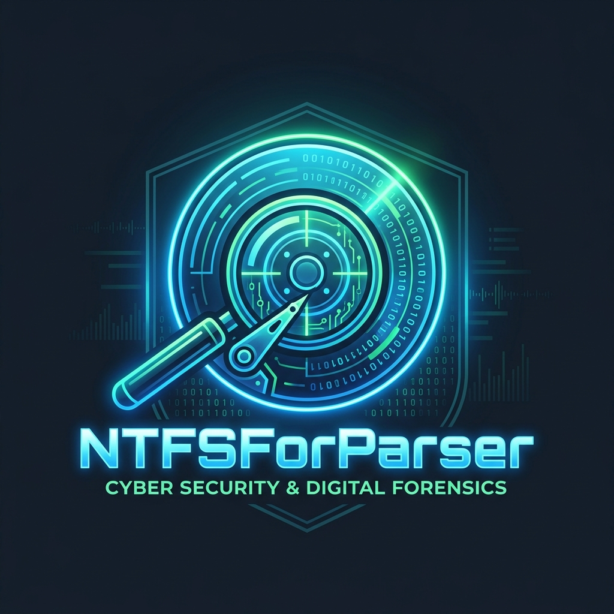

# NTFSForParser - Framework Forense Educativo

<div align="center">
  
</div>


**NTFSForParser** es un framework interactivo desarrollado en Python, diseñado con un enfoque netamente **educativo y pedagógico**. Su objetivo es permitir a los estudiantes de informática forense sumergirse en las profundidades de los sistemas de archivos, entendiendo las estructuras de bajo nivel (hexadecimal), metadatos, y técnicas de recuperación sin depender de interfaces gráficas complejas o cajas negras.

Actualmente soporta análisis profundo sobre particiones **FAT12**, **FAT16**, **FAT32**, **exFAT** y **NTFS**, e inspección base para **Ext4** (Linux), procesando tanto imágenes crudas (`.dd`, `.raw`, fragmentadas `.001`) como imágenes adquiridas en formato **EnCase (`.e01`)** y **dispositivos físicos directos** (`\\.\PhysicalDriveX`, `\\.\C:`).

---

## 🚀 Características Principales

1. **Shell Interactivo Forense:** Navega por la imagen de disco utilizando una interfaz de línea de comandos similar a Bash, permitiendo saltar de sector en sector, interpretar clústeres, o moverte por el árbol de directorios de la imagen investigada.
2. **Interfaz Gráfica Interactiva (GUI Modo Claro Forense):** Visualizador gráfico (estilo Autopsy) desarrollado en Tkinter con diseño Claro/Blanco moderno, barra de particiones físicas responsiva, explorador jerárquico de archivos, previsualizador de datos Hexdump/Texto continuo y mapa interactivo de clústeres.
3. **Soporte MACB Total:** Parseo y extracción nativa de metadatos temporales:
   - Fechas MS-DOS para entornos FAT12/16/32 y exFAT.
   - Fechas FILETIME (`$STANDARD_INFORMATION`) de 100-nanosegundos para MFT (NTFS).
4. **Desglose Didáctico de Campos y Resaltado Hexadecimal:** 
   - Decodificación detallada de cada campo de las entradas de metadatos (Directory Entries FAT 32-bytes, Registros MFT NTFS 1024-bytes e Inodos Ext4).
   - Resaltado automático en amarillo (`#fff59d`) de la sección hexadecimal del archivo seleccionado en los visores de previsualización.
5. **Mapa Visual Interactivo de Clústeres:**
   - Representación granular con bloques pequeños adaptables y barras de desplazamiento vertical y horizontal.
   - Reorganización dinámica (*responsive grid*) al cambiar el tamaño de la ventana.
   - Inspección en tiempo real al hacer clic sobre cualquier clúster: calcula offset físico (disco), LBA, offset relativo (volumen), sector lógico y muestra su volcado binario en caliente.
6. **Detección Forense de Volúmenes Cifrados:** Identificación automática de volúmenes **BitLocker** (`-FVE-FS-`) con explicación didáctica de por qué los metadatos lógicos están protegidos y qué acciones forenses (carving / sector raw) son posibles.
7. **Navegación Jerárquica y Explicación VBR:** Navegación por directorios (`cd`/`ls`) y decodificación explicativa del BIOS Parameter Block (VBR) para todos los file systems.
8. **Data Carving y Recuperación:** Usa el comando `recover` para reconstrucción forense a partir de metadatos de archivos borrados: NTFS (reconstrucción completa fragmentada vía Data Runs), exFAT (reconstrucción íntegra vía `NoFatChain` o cadenas FAT), y FAT12/16/32 (extracción contigua).
9. **Comprobación de Integridad Forense Avanzada:** Usa `hash_check` para verificar hashes. Para E01, extrae y compara hashes MD5/SHA1 internos y realiza comprobaciones de integridad CRC por chunk.
10. **File Carving Automatizado:** Soporte para más de 50 firmas de archivos estructurados por categorías usando Magic Bytes (configurable en `signatures.conf`).
11. **Dispositivos y Múltiples Formatos Soportados:** Imágenes RAW completas, Divididas/Split (`.001`, `.002`), contenedores EnCase (`.e01`) y discos/unidades físicas directas del host (`devices`).
12. **Soporte Completo i18n Bilingüe:** 100% del framework traducido (mensajes, errores, parsers y ayuda contextual) a Español e Inglés (inicializable con `--lang en`).
13. **Ayuda Contextual y Autocompletado:** Menú de ayuda general (`help` o `?`) categorizado, ayuda en caliente (`<comando> ?`) y autocompletador inteligente para rutas del host local.

---

## ⚙️ Requisitos e Instalación

Este framework utiliza componentes nativos de la librería estándar de Python (`struct`, `hashlib`, `cmd`, `argparse`, etc.) para fomentar el aprendizaje y no depender de dependencias mágicas. 

La **única** excepción es la librería para leer el formato propietario E01.

### 1. Requisitos
- Python 3.8+
- Instalar las dependencias listadas en el `requirements.txt`:
  ```bash
  pip install -r requirements.txt
  ```
  *(Nota: Esto instalará `libewf-python`, necesario para manejar compresión e indexación de contenedores `.e01`)*

### 2. Uso y Arranque
Para arrancar el analizador, simplemente ejecuta `main.py` pasándole la ruta de tu imagen forense o dispositivo.
*(Nota: Si intentas abrir un disco físico `\\.\PhysicalDrive0`, asegúrate de correr tu consola como Administrador).*

```bash
# Iniciar el shell interactivo con una imagen E01
python main.py ruta_a_la_imagen.e01

# Iniciar la interfaz gráfica interactiva (GUI) directamente
python main.py imagen.dd --gui

# Abrir en modo Verbose explicativo
python main.py imagen.dd -v

# Ejecución rápida por CLI sin entrar a la shell
python main.py imagen.dd --part 0 --cluster 500
python main.py imagen.dd --identify-sector 2048
python main.py imagen.dd --part 0 --runs "Zone.Identifier"
python main.py imagen.dd --part 0 --dump-clusters 100 +50 volcado.bin
```

---

## 💻 Comandos del Shell

Una vez dentro de la consola `Forense >`, tienes a tu disposición un arsenal de comandos. Escribe `help` para ver la lista en cualquier momento.

### Gestión de Particiones, Dispositivos e Imágenes
- `gui`: Inicia la **Interfaz Gráfica Interactiva (Tkinter)** con explorador jerárquico de archivos, mapa de clústeres responsivo e inspección de offsets en tiempo real.
- `devices` (o `open` sin argumentos): Enumera todos los discos físicos (`\\.\PhysicalDriveX`) y unidades lógicas (`\\.\C:`) presentes en el sistema host.
- `open [-v] <ruta>`: Abre una nueva imagen o disco físico. La bandera `-v` activa el **Modo Verbose Forense**, explicando paso a paso el contenedor, MBR/GPT y firmas.
- `partitions`: Lista todas las particiones encontradas en la Tabla de Particiones (MBR/GPT).
- `select <num>`: Activa y monta internamente una de las particiones listadas.
- `imageinfo`: Imprime todos los metadatos forenses almacenados por el perito si la imagen es un contenedor EnCase (.e01).
- `hash_check [md5|sha1|sha256|all]`: Verifica la integridad de la imagen cargada. **Para E01**: (1) lee los hashes almacenados en el contenedor (MD5/SHA1), (2) verifica los CRC internos por chunk, (3) calcula los hashes reales y los compara — emitiendo veredicto sobre la cadena de custodia. **Para RAW/DD**: calcula y muestra los hashes sin referencia.
- `exit` (o `quit`): Cierra la consola y finaliza la sesión de análisis interactivo.

### Inspección de Bajo Nivel
- `hexdump <offset>`: Volcado hexadecimal puro desde el inicio del archivo.
- `sector <lba>`: Muestra el contenido físico en el LBA (Logical Block Addressing) indicado.
- `cluster <num>`: Muestra el clúster lógico calculando los offsets relativos a la partición actual.
- `clustermap`: Renderiza un mapa visual/ASCII de ocupación de clústeres directamente en consola.
- `go sector <num>` (o `cluster`): Atajo rápido para saltar e inspeccionar un sector o clúster directamente.
- `identify sector <num>` (o `cluster`): Lee los Magic Bytes y firmas de la cabecera e intenta adivinar qué estructura es (VBR, Registro MFT, Inicio de PDF, Zip, JPEG, etc).

### Navegación del File System (FAT / NTFS / Ext4)
- `vbr`: Desgrana y traduce los valores del Volume Boot Record o BPB. Soporta decodificación detallada de parámetros VBR para FAT12, FAT16, FAT32, exFAT y NTFS.
- `ls`: Lista los archivos, directorios, sus estados de borrado y fechas de modificación. Soporta lectura de Inodo 2 en Ext4 y directorios exFAT.
- `cd <carpeta>`: Adéntrate en los directorios del File System. Usa `cd ..` para volver atrás.
- `info <id>`: Muestra toda la meta-información técnica de ese archivo (Atributos, Tamaño, Fechas completas, Residentes vs No-Residentes). ¡Avisa si existen flujos ADS ocultos en NTFS!
- `runs <id | nombre>`: Imprime las direcciones físicas del disco donde el archivo guarda su información. Soporta Cadenas FAT, Data Runs (NTFS) y Árbol de Extents (Ext4). Puedes buscar flujos específicos como `runs 12:Zone.Identifier`.

### Lectura y Recuperación de Evidencia
- `cat <nombre | id | sector X | cluster Y>`: Imprime por consola el texto o vuelca el hexdump de un archivo o bloque de disco. Soporta sintaxis `cat id:stream_name` para extraer ADS. Ensambla archivos No-Residentes.
- `extract <id> <ruta_destino>`: Copia de forma forense el archivo (residente o no-residente) desde la imagen de disco hacia tu PC.
- `recover <id> <ruta_destino>`: Recupera un archivo borrado utilizando metadatos estructurados. **Para NTFS**: reconstruye el archivo completo respetando su fragmentación original a partir de los Data Runs/atributos del registro MFT (incluso si está inactivo/borrado). **Para exFAT**: utiliza la bandera `NoFatChain` de la entrada de metadatos (si es contiguo) para recuperarlo de forma íntegra, o recorre la cadena FAT de 32 bits. **Para FAT12/16/32**: realiza una extracción contigua a partir del clúster de inicio y el tamaño original del archivo.
- `dump_clusters <inicio> <fin | +cantidad> <destino>` (o `dump_blocks`): Extrae un rango directo de clústeres o bloques crudos del disco. Ej: `dump_clusters 100 +50 out.bin`.
- `search [-r] <patron>`: Busca un texto o expresión regular (-r) a lo largo de toda la partición. Soporta automáticamente codificación ASCII/UTF-8 y UTF-16LE (común en MFT). Extrae el contexto y su offset físico.
- `carve [directorio_destino] [tipos...]`: Realiza **File Carving automatizado** sobre la partición cruda buscando firmas de Magic Bytes. El directorio es opcional (por defecto: directorio actual). Se puede filtrar por tipo: `carve jpg pdf` o `carve ./out mkv mp4`.
  - **Imágenes:** `jpg` `png` `gif` `bmp` `tif` `webp` `ico` `psd`
  - **Audio:** `mp3` `wav` `flac` `ogg` `m4a` `mid`
  - **Vídeo:** `mp4` `avi` `mkv` `flv` `mpg` `wmv`
  - **Documentos:** `pdf` `docx` `doc` `rtf` `xml` `html` `odt`
  - **Comprimidos:** `zip` `rar` `7z` `gz` `bz2` `xz` `tar` `iso` `vmdk`
  - **Ejecutables:** `exe` `elf` `macho` `class` `pyc` `wasm`
  - **BD / Registros Windows:** `db` `hive` `evt` `evtx` `pf` `lnk` `dmp`
  - **Forenses / Red:** `pcap` `pcapng`
  - **Crypto / Claves:** `cer` `pem` `pgp`
  - **Email / Office:** `eml` `msg` `pst`
  - **Otros:** `ttf` `woff` `jar` `apk` `torrent` `swf`
- `find_orphans [limite]`: Escanea la MFT (NTFS) en busca de archivos huérfanos (cuyo directorio padre ha sido borrado o no existe).

### Sistemas Ext4 (Linux)
- `superblock`: Lee las configuraciones maestras de la partición Linux mostrando inodos, bloques y timestamps de montaje.
- `ls / cd / cat / extract`: Soporte integrado nativo en la capa de Extents de Ext4 para listar carpetas (desde el Inodo 2) y extraer archivos crudos a disco.

---

## 🧪 Pruebas y Desarrollo

El framework incluye herramientas nativas para simular imágenes de disco GPT con todas las particiones soportadas pobladas con archivos de prueba activos y eliminados:

1. **Generar la imagen de prueba (`test_disk.raw`)**:
   ```bash
   python scratch/generate_test_image.py
   ```
   *(Este comando genera un archivo mock de 50 MB con Protective MBR, GPT y 6 particiones válidas de FAT12, FAT16, FAT32, exFAT, NTFS y Ext4 de forma portable y sin privilegios de administración).*

2. **Ejecutar la suite de validación automatizada**:
   ```bash
   python scratch/test_mock_image.py
   ```
   *(Este test verifica el montaje, lectura de directorios, decodificación de metadatos, comandos GUI/CLI y recuperación a bajo nivel para todas las particiones del disco de prueba).*

---

## 🗺️ Roadmap (Próximas Funcionalidades)

- [ ] Soporte para análisis de particiones APFS / HFS+ (Apple).
- [x] Visualizador dinámico e interactivo de mapas de clústeres ocupados/libres (GUI + CLI).
- [ ] Mapeo e interpretación automática de estructuras complejas (Journal JBD2 de Ext4 y transacciones de NTFS).
- [ ] Generación automática de reportes de hallazgos forenses en formato HTML y PDF.


> *Desarrollado para entornos académicos y enseñanza de análisis binario y file systems.*
